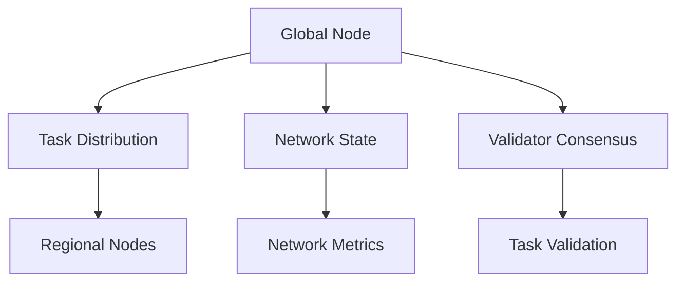

# Tenzro Global Node

A global node for the Tenzro Network, responsible for network coordination, task distribution, and cross-regional task management.

## Features

- Cross-regional task coordination and distribution
- Global network state management
- Validator consensus participation
- Task result aggregation and validation
- Network health monitoring
- DHT-based peer discovery and management

## Prerequisites

- Node.js 18.x
- npm 10.x
- Docker (for containerized deployment)
- Heroku CLI (for Heroku deployment)

## Installation

```bash
# Clone the repository
git clone https://github.com/tenzro/global-node.git
cd global-node

# Install dependencies
npm install

# Copy environment file and configure
cp .env.example .env

# Build the project
npm run build
```

## Configuration

Edit `.env` file with your settings:

```env
# Node Configuration
NODE_ENV=production
NODE_TYPE=global_node
NODE_TIER=training
REGION=us-east
TOKEN_BALANCE=10000

# Network Configuration
DHT_ENABLED=true
DHT_REFRESH_INTERVAL=60000
DHT_REPLICATION_FACTOR=3
METRICS_UPDATE_INTERVAL=15000
HEALTH_CHECK_INTERVAL=30000
BOOTSTRAP_NODES=  # URLs of other global nodes if any

# Resource Limits
MAX_CONCURRENT_TASKS=100
TASK_TIMEOUT=3600
```

## Running

### Development Mode

```bash
# Start with hot reloading
npm run dev

# Run tests
npm test

# Run linting
npm run lint
```

### Production Mode

```bash
# Build and start
npm run build
npm start
```

### Docker Deployment

```bash
# Build image
docker build -t tenzro-global-node .

# Run container
docker-compose up -d
```

### Heroku Deployment

```bash
# Login to Heroku
heroku login

# Create Heroku app
heroku create tenzro-global-node-[region]

# Configure environment
heroku config:set \
    NODE_ENV=production \
    NODE_TYPE=global_node \
    NODE_TIER=training \
    REGION=[region] \
    -a tenzro-global-node-[region]

# Deploy
git push heroku main
```

## API Endpoints

### Network Management

- `GET /health` - Node health status
- `GET /status` - Node status and metrics
- `GET /api/network/state` - Current network state

### Task Management

- `POST /api/tasks` - Submit new task
- `GET /api/tasks/:taskId` - Get task status
- `GET /api/tasks/:taskId/result` - Get task result

### Validator Operations

- `GET /api/network/validators` - List connected validators
- `GET /api/network/metrics` - Network performance metrics

## Architecture



### Components

- **Global Node Manager**: Coordinates network operations
- **Cross-Region Task Coordinator**: Manages task distribution
- **Network State Manager**: Maintains network state
- **DHT Network**: Handles peer discovery and data storage
- **Task Manager**: Processes and validates tasks
- **Metrics Collector**: Monitors network health

## Monitoring & Logging

- Health checks run every 30 seconds
- Metrics updated every 15 seconds
- Logs available through standard output and `/logs` directory
- Prometheus metrics available at `/metrics`

## Security

- TLS encryption for all communications
- Node authentication using public key infrastructure
- Rate limiting on API endpoints
- DDoS protection through Heroku

## Contributing

1. Fork the repository
2. Create your feature branch: `git checkout -b feature/amazing-feature`
3. Commit your changes: `git commit -m 'Add amazing feature'`
4. Push to the branch: `git push origin feature/amazing-feature`
5. Open a Pull Request

## Testing

```bash
# Run unit tests
npm test

# Run integration tests
npm run test:integration

# Run all tests with coverage
npm run test:coverage
```

## Deployment Considerations

1. **Resource Requirements**:
   - Minimum 2 CPU cores
   - 4GB RAM
   - 20GB storage

2. **Network Requirements**:
   - Public IP address
   - Open ports: 8080 (HTTP), 8081 (P2P)
   - Stable internet connection

3. **Scaling**:
   - Horizontal scaling supported through Heroku dynos
   - Auto-scaling based on network load
   - Geographic distribution recommended

## Troubleshooting

Common issues and solutions:

1. **Connection Issues**:
   ```bash
   # Check bootstrap nodes
   curl http://localhost:8080/status
   # View connection logs
   tail -f logs/network.log
   ```

2. **Performance Issues**:
   ```bash
   # Check resource usage
   docker stats
   # View metrics
   curl http://localhost:8080/metrics
   ```

## License

Licensed under the Apache 2.0 License - see the [LICENSE](LICENSE) file for details.

## Contact

- Website: https://tenzro.org
- GitHub: https://github.com/tenzro
- X: https://x.com/tenzr0